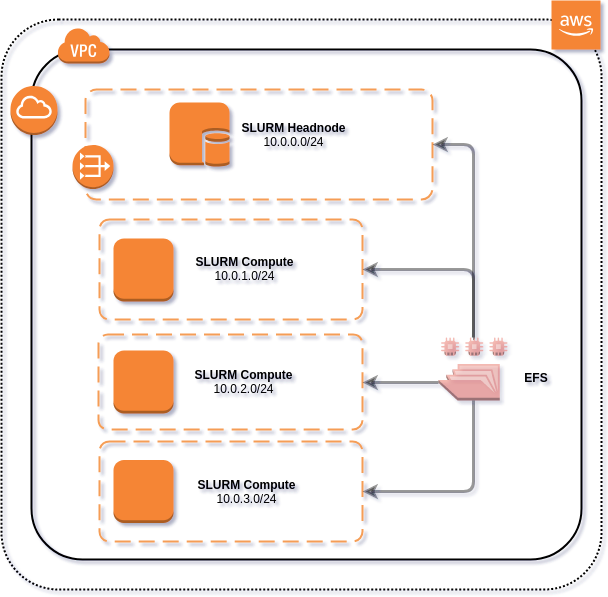

## AWS Plugin for Slurm

A sample integration of AWS services with Slurm

## License Summary

This sample code is made available under a modified MIT license. See the LICENSE file.

## Requirements

You will need an AWS Account with S3 Read/Write permissions. As well as the ability to execute CloudFormation scripts. The cloudformation script will provision a landing zone with a public subnet and 3 private subnets each private subnet will route into the public subnet via a NAT Gateway. Permissions to create the network topology will be needed.

You can optionally add an EFS endpoint so that all ephemeral SLURM compute nodes and the headnode can have a common namespace.